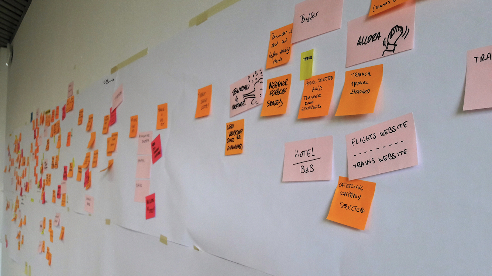
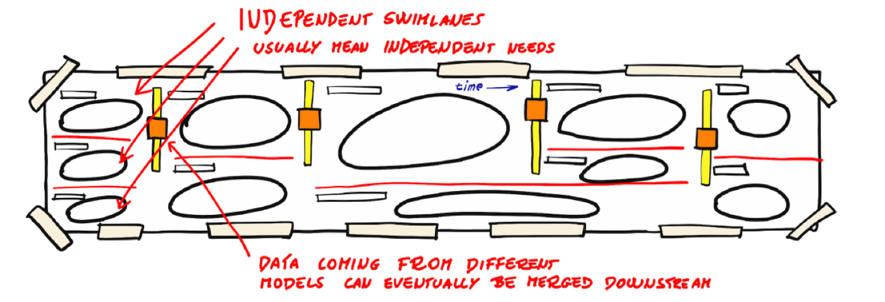
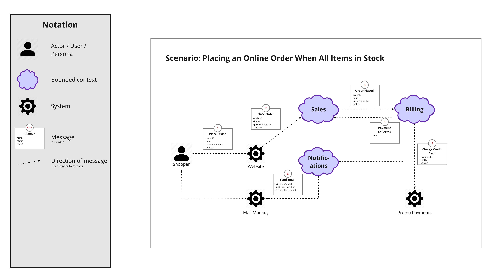
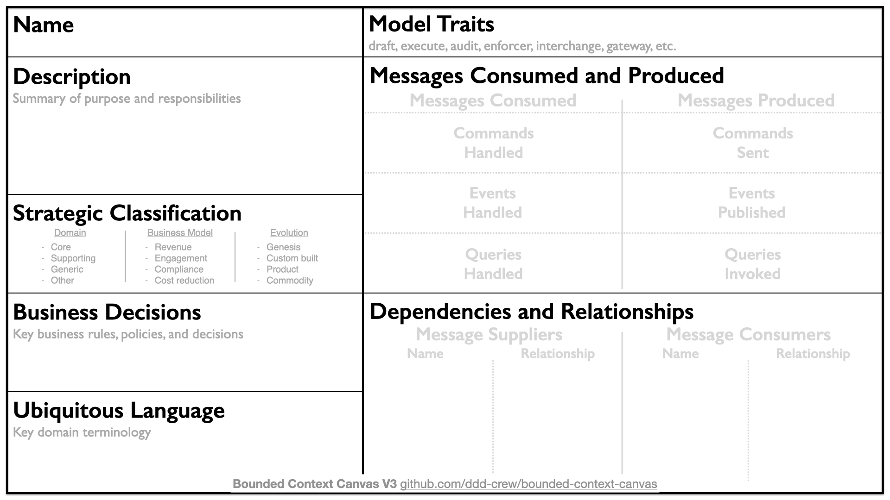

# Domain-Driven Design Starter Modelling Process

This process gives you a step-by-step guide for learning and practically applying each aspect of Domain-Driven Design -- from orienting around an organisation's business model to coding a domain model.

Using this process will guide you through each of the essential steps in a designing a software system with the DDD mindset, so you can focus on your business challenges and not be overwhelmed by learning DDD at the same time. 

Once you have been through a few iterations of the process you will have the foundational DDD theory and practical experience to go deeper into DDD. Then you will be able to adapt and improve the process to suit your needs in any context. On a real project you'll constantly be jumping back and forth between all of these steps.

> This process is for beginners. It is not a linear sequence of steps that you should standardise as a best practice. Domain-Driven Design is an evolutionary design process which necessitates continuous iteration on all aspects of knowledge and design.

## When to use the DDD Starter Modelling Process?
If you're new to DDD or you're just not sure where to start, this process can reduce you're cognitive and guide you through the process in the following scenarios, and possibly others:

### Kicking Off a Greenfield Project
At the start of a new project the number of things you need to think about can be overwhelming. One or two iterations of this process can help you put the foundations in place.

### Beginning a Brownfield Migration
Before getting to work on moderinising your legacy system, a few iterations of this process can help you to uncover essential information needed to create a vision for your target architecture.

### Kicking Off a Major Program of Work
When starting a new initiative that involves a significant investment across many teams, it is essential to cover the 8 steps in the process. This process can guide you through the first few iterations.

### Explore Your Domain for New Learning Opportunities
Software development is a learning process. You can apply this process at any time to uncover new insights, identify new opportunities, or simply share knowledge around the team.

### Assess Current State of Your Project
This process can be the foundation for assessing how well your current system is aligned to the domain and business model. 

### Re-organising Teams
A loosely-coupled architecture enables teams to work in parallel without being blocked. But a loosely-coupled architecture must be aligned to coupling in the domain. This process will help you to design a software architecture and a team structure aligned with your domain.

### Practicing or Learning DDD
This process is ideal when you are new to DDD and want to practice or you want to teach others the different aspects of modelling a domain. It's important to communicate that this linear process is not a realistic process, it's just a starting point to reduce cognitive load until you are confident with DDD.

## How to Adapt the Process?
This process can be customised an infinite number of ways. On a real project, you'll constantly be switching between all 8 steps based on the new insights you gain or need to gain.

Below are a few reasons for deciding when to change the order or switch between steps.

### Start with Collaborative Modelling
If you want to get our whole team collaborating immediately, modelling the domain which they are familiar with might be more comfortable than talking about business models and strategy which they are less comfortable with.

### Start by Assessing IT Landscape
Before looking forward to the business vision and going deep into the domain, it might be better to start with step 5 and map out the existing existing architecture as a strategic portfolio to see what the major constraints you will face are.

### Code Before Confirming Architecture and Team Boundaries
On some projects it makes sense to start by writing code sooner. Perhaps you need to deliver an MVP or the domain is so complex that creating a model in code is necessary before you can consider the architecture.

### Repeat Steps 2 - 5 Before Moving to 6
Before you dive into the design of individual bounded contexts, it may be beneficial to model the domain multiple times and look for a multiple ways to decompose your system into sub-domains.

### Organise Teams Before Designing Contexts
For a great deal of projects there are organisational constraints. If this is the case, you should consider identifying possible team structures before designing architectures that you will never be able to implement due to the organisational constraints.

### Blending Design and Coding
Steps 6 and 8 can occur concurrently. This may occur when you are coding a bounded context and the insights you get from writing code for you to change the high-level design.

## The Process
This process is composed of 8 steps which are introduced below:

### 1. Align
Align our focus with the organisations' business model, the needs of its users, and it's short, medium. and long-term goals.

As a starting point, we recommend [The Business Model Canvas](https://www.strategyzer.com/canvas/business-model-canvas).

#### Why
Every decision we take regarding the architecture, the code, or the organisation has business consequences. In order to design, build, and evolve software systems most effectively, our decisions need to create the optimal business impact, which can only be achieved if we are aligned to the business goals.

#### Tools
- [The Business Model Canvas](https://www.strategyzer.com/canvas/business-model-canvas)
- [The Product Strategy Canvas](https://melissaperri.com/blog/2016/07/14/what-is-good-product-strategy)
- [Impact Mapping](https://www.impactmapping.org/)
- [Wardley Mapping](https://learnwardleymapping.com/)

#### Who to Involve
- Business Stakeholders
- Product Managers
- Project Sponsors
- Senior Management
- Technology Leadership

### 2. Discover
Discover the domain visually and collaboratively.

As a starting point, we recommend [EventStorming](https://www.eventstorming.com/).

#### Why
Spreading domain knowledge through the whole team will create the shared understanding that enables the developers to build a software system aligned to the team and more able to incorporate future business changes. 

Spreading domain knowledge throughout the whole team enables the whole team to contribute ideas for improving the product.

#### Tools
- [EventStorming](https://www.eventstorming.com/)
- [Domain Storytelling](https://domainstorytelling.org/)
- [User Journey Mapping](https://boagworld.com/audio/customer-journey-mapping/)
- [Example Mapping](https://cucumber.io/blog/bdd/example-mapping-introduction/)

#### Who to Involve
- Domain Experts
- Development Team
- Customer Support
- Business Leadership
- Real Users
- Anyone with Domain Knowledge 

### 3. Decompose
Decompose the domain into sub-domains - loosely-coupled parts of the domain.

As a starting point, we recommend [carving up your event storm](resources/event-storm-bounded-context.jpg) into sub-domains.

*Credit: Alberto Brandolini*

#### Why
We decompose a large problem domain into sub-domains for a few key reasons:

- reduced cognitive load, so that we can reason about parts of the domain independently
- identifying loose-coupling and high-cohesion in the domain which carries over to our software architecture and team structure

#### Tools
- [EventStorming with sub-domains](https://www.eventstorming.com/)
- [Design Heuristics](https://www.dddheuristics.com/)
- [Independent Service Heuristics](https://github.com/TeamTopologies/Independent-Service-Heuristics)
- [Business Capability Modelling](https://www.slideshare.net/trondhr/from-capabilities-to-services-modelling-for-businessit-alignment-v2)

#### Who to Involve
- Software Architects
- Software Engineers
- Domain Experts
- Product Managers

### 4. Connect
Connect the sub-domains into a loosely-coupled architecture which fulfills end-to-end business use-cases.

#### Why
It is imperative to not only decompose a large domain into parts but to also carefully design the interactions between those parts to minimise unwanted coupling and complexity. It is necessary to challenge the initial design by applying concrete use-cases to uncover hidden complexity.

As a starting point, we recommend [Domain Message Flow Modelling](https://github.com/ddd-crew/domain-message-flow-modelling).

.
#### Tools
- [Domain Message Flow Modelling](https://github.com/ddd-crew/domain-message-flow-modelling)
- [Process Modelling EventStorming](https://www.eventstorming.com/)
- [Sequence Diagrams](https://en.wikipedia.org/wiki/Sequence_diagram)
- [BPMN](https://en.wikipedia.org/wiki/Business_Process_Model_and_Notation)

#### Who to Involve
- Software Architects
- Software Engineers
- Domain Experts
- Product Managers

### 5. Strategize
Strategically map out your sub-domains to identify core domains: the parts of the domain which have the greatest potential for business differentiation or strategic significance.

#### Why
Time and resources are limited so understanding which parts of the domain to focus on is critical to delivering optimal business impact. 

By understanding what your core domains are, you will have a better idea of how much quality and rigour to each part of your system, and you'll be able to make highly-educated build vs buy vs outsource decisions.

As a starting point, we recommend [Core Domain Charts](https://github.com/ddd-crew/core-domain-charts).

#### Tools
- [Wardley Mapping](https://learnwardleymapping.com/)
- [Core Domain Charts](https://github.com/ddd-crew/core-domain-charts)
- [Purpose Alignment Model](https://www.informit.com/articles/article.aspx?p=1384195&seqNum=2)

#### Who to Involve
- Software Architects
- Software engineers
- Technology Leadership
- Domain Experts
- Business Stakeholders
- Product Managers

### 6. Design
Design a software architecture aligned to sub-domains in the domain using [bounded contexts](https://martinfowler.com/bliki/BoundedContext.html).

As a starting point, we recommend the [Bounded Context Canvas](https://github.com/ddd-crew/bounded-context-canvas).

#### Why
Before committing to a design, make explicit decisions about the design choices which can have a significant impact on the overall design. Have these conversations early while it is still easy to change your mind and explore alternative models.

Design collaboratively and visually and start to consider the technical limitations so that you can uncover constraints or opportunities. 

#### Tools
- [Bounded Context Canvas](https://github.com/ddd-crew/bounded-context-canvas)
- [Quality Storming](https://speakerdeck.com/mploed/quality-storming)

#### Who to Involve
- Software Engineers
- Development Team
- Product Managers

### 7. Organise

#### Why

#### Tools
- Team Topologies
- Context Maps

#### How to Facilitate

#### Who to Involve

### 8. Model

#### Why

#### Tools
- Aggregate Design Canvas
- Design-level EventStorming

#### How to Facilitate

#### Who to Involve

## Contributors

Thank you to the following individuals who have all contributed to the DDD Starter Modelling Process:

- [Gien Verschatse](https://twitter.com/selketjah)
- [Kacper Gunia](https://github.com/cakper)
- [James Morcom](https://twitter.com/morcs)
- [Maxime Sanglan-Charlier](https://twitter.com/__MaxS__)
- [Michael Plöd](https://twitter.com/bitboss?lang=en)
- [Nick Tune](https://github.com/ntcoding)

## Contributions and Feedback

The Domain-Driven Design Starter Modelling Process is freely available for you to use. In addition, your feedback and ideas are welcome to improve the technique or to create alternative versions. 

Feel free to also send us a pull request with your examples or experience reports.

[![CC BY 4.0][cc-by-shield]][cc-by]

This work is licensed under a [Creative Commons Attribution 4.0 International
License][cc-by].

[![CC BY 4.0][cc-by-image]][cc-by]

[cc-by]: http://creativecommons.org/licenses/by/4.0/
[cc-by-image]: https://i.creativecommons.org/l/by/4.0/88x31.png
[cc-by-shield]: https://img.shields.io/badge/License-CC%20BY%204.0-lightgrey.svg